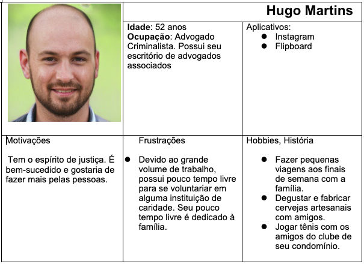

# Especificações do Projeto

A determinação exata do problema, suas personas, requisitos funcionais e não-funcionais foram acordadas em reuniões online entre os membros da equipe. Foram reunidas informações e observações e, complementarmente. Os detalhes levantados nesse processo auxiliaram na construção de personas e histórias de usuários.

## Personas

As personas levantadas durante o processo de entendimento do problema são apresentadas na Figuras que se seguem. 

## Histórias de Usuários

A partir da compreensão do dia a dia das personas identificadas para o projeto, foram registradas as seguintes histórias de usuários. 

|EU COMO... `PERSONA`| QUERO/PRECISO ... `FUNCIONALIDADE` |PARA ... `MOTIVO/VALOR`                 |
|--------------------|------------------------------------|----------------------------------------|
|Hugo Martins        | Encontrar uma ONG que esteja arrecadando dinheiro para realização de projetos ligados ao basquete                   | Para que seja possível incentivar o esporte e apoiar jovens que estejam interessados, tanto no lazer, quanto na carreira.    que possam administrar contas |
|Hugo Martins  | Ser notificado caso tente cadastrar um novo usuário com o mesmo e-mail          | Evitar cadastros duplicados               |
|Hugo Martins  | Acessar regularmente sua conta cadastrada por meio de login           | Evitar cadastros duplicados               |
|Paula Matos   | Cadastrar a ONG Marmitas Solidárias e as vagas em aberto para voluntários interessados em participar da distribuição das marmitas          | Buscar voluntários para apoiar e ampliar as ações do projeto              |
|Paula Matos   | Cadastrar informações sobre pontos de coleta de arrecadação de alimentos          | Facilitar a arrecadação de alimentos para a ONG              |
|Paula Matos   | Avaliar o perfil dos candidatos que aplicaram para ocupar as vagas          | Para decidir se vai aceitar ou negar a candidatura                |
|Paula Matos   | Buscar voluntários maiores de 18 anos          | Assegurar que menores de idade não estão realizando tarefas vedadas para suas idades                |
|Beatriz Costa   | Ter a possibilidade encerrar sua participação como voluntária quando necessário           | Encerrar formalmente sua participação caso não seja possível prosseguir com o trabalho voluntário              |
|Beatriz Costa   | Avaliar a qualidade do trabalho prestado pela ONG           | Permitir que outros voluntários tenham mais fundamento para decidirem se desejam ou não trabalhar na instituição              |
|Beatriz Costa   | Cadastrar-se para apoiar ONGs  que estejam envolvidas com proteção animal           | Evitar cadastros duplicados               |
|Hugo Martins  | Ser notificado caso tente cadastrar um novo usuário com o mesmo e-mail          | Dedicar o tempo livre a causas que despertam o interesse pessoal e ganhar experiência profissional               |
|Renata Alcântara   | Recuperar o acesso ao site em caso de perda da senha          | Evitar ter que cadastrar um novo usuário e perder o acesso aos registros anteriores               |
|Renata Alcântara   | Ser notificada por e-mail quando for aprovada para a vaga          | Acompanhar se o processo de candidatura foi bem sucedido                 |
|Renata Alcântara   | Cadastrar-se como voluntária para auxiliar estudantes a melhorarem seu desempenho nos estudos          | Elevar as chances de estudantes conseguirem ingressar no ensino superior ou serem aprovados no ano letivo                |
|Pedro Silva   | Cadastrar a ONG e as vagas para encontrar professores que possam ensinar aos alunos que farão o ENEM           | Poder discutir com os amigos e colegas de trabalhos sobre temas de interesse                |
|Pedro Silva   | Cadastrar informações para arrecadação de doações financeiras           | Garantir a manutenção das instalações físicas da escola e proporcionar material didático aos alunos.               |
|Pedro Silva  | Avaliar o trabalho prestado pelos voluntários à ONG           | Permitir que outras ONGs avaliem melhor a candidatura do voluntário              |

## Requisitos

O escopo funcional do projeto é definido por meio dos requisitos funcionais que descrevem as possibilidades interação dos usuários, bem como os requisitos não funcionais que descrevem os aspectos que o sistema deverá apresentar de maneira geral. Estes requisitos são apresentados a seguir. 

### Requisitos Funcionais

A tabela a seguir apresenta os requisitos do projeto, identificando a prioridade em que os mesmos devem ser entregues. 

|ID    | Descrição do Requisito  | Prioridade |
|------|-----------------------------------------|----|
|RF-001| O sistema permitirá cadastro de usuários gestores de ONG; | ALTA | 
|RF-002| O sistema permitirá cadastro de usuários voluntários/doadores;   | ALTA |
|RF-003| O sistema permitirá que os usuários criados efetuem login;   | ALTA |
|RF-004| O sistema permitirá que os usuários criados possam excluir seu usuário;   | ALTA |
|RF-005| O sistema deve permitir que o usuário cadastre uma nova senha caso ele esqueça a atual;   | MÉDIA |
|RF-006| O sistema deve verificar se o usuário já foi cadastrado   | ALTA |
|RF-007| O sistema deve verificar se o usuário possui mais de 18 anos   | MÉDIA |
|RF-008| O usuário Gestor das ONGs poderá criar vagas para voluntários   | ALTA |
|RF-009| O usuário Gestor das ONGs poderá inserir informações para doações   | ALTA |
|RF-010| O usuário Gestor das ONGs poderá descrever as atividades da sua ONG   | ALTA |
|RF-011| O usuário voluntario poderá aplicar filtros nas vagas disponíveis   | MÉDIA |
|RF-012| O usuário Gestor das ONGs poderá avaliar o perfil dos candidatos das vagas assim como podendo aceitar ou negar a candidatura   | ALTA |
|RF-013| Usuários aprovados pelos gestores receberam um e-mail de confirmação   | BAIXA |
|RF-014| Usuários voluntários podem encerrar sua participação nas ONGs pelo site   | BAIXA |

### Requisitos não Funcionais

A tabela a seguir apresenta os requisitos não funcionais que o projeto deverá atender.

|ID     | Descrição do Requisito  |Prioridade |
|-------|-------------------------|----|
|RNF-001| O site deve ser publicado em um ambiente acessível publicamente na Internet (Repl.it, GitHub Pages, Heroku);  | ALTA | 
|RNF-002| O site deverá ser responsivo permitindo a visualização em um celular de forma adequada |  MÉDIA | 
|RNF-003| O site deve ter bom nível de contraste entre os elementos da tela em conformidade  | MÉDIA | 
|RNF-004| O site deve ser compatível com os principais navegadores do mercado (Google Chrome, Firefox, Microsoft Edge) |  ALTA | 
|RNF-005| O site deverá utilizar banco de dados relacional (SQL like) | ALTA | 
|RNF-006| Utilizar a linguagem C# framework .net utilizando Entity framework e React |  ALTA | 

## Restrições

As questões que limitam a execução desse projeto e que se configuram como obrigações claras para o desenvolvimento do projeto em questão são apresentadas na tabela a seguir.

|ID| Restrição                                             |
|--|-------------------------------------------------------|
|RE-01| O projeto deverá ser entregue no final do semestre letivo, não podendo extrapolar a data de 11/12/2022. |
|RE-02| O aplicativo deve se restringir às tecnologias básicas da Web no Frontend e no Back-end.|
|RE-03| A equipe não pode subcontratar o desenvolvimento do trabalho.|

## Diagrama de Casos de Uso

Os componentes abaixo representam o diagrama de casos de uso da solução ONGs, nele podemos ver como cada Ator interage com o sistema.

