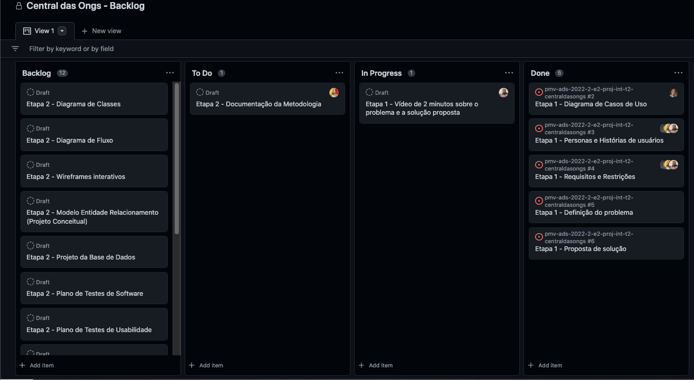

# Metodologia

A metodologia contempla as definições de ferramental utilizado pela equipe tanto para a manutenção dos códigos e demais artefatos quanto para a organização do time na execução das tarefas do projeto.

## Controle de Versão

A ferramenta de controle de versão adotada no projeto foi o
[Git](https://git-scm.com/), sendo que o [Github](https://github.com)
foi utilizado para hospedagem do repositório.

O projeto segue a seguinte convenção para o nome de branches:

- `main`: versão estável já testada do software
- `unstable`: versão já testada do software, porém instável
- `testing`: versão em testes do software
- `dev`: versão de desenvolvimento do software

Quanto à gerência de issues, o projeto adota a seguinte convenção para
etiquetas:

- `documentation`: melhorias ou acréscimos à documentação
- `bug`: uma funcionalidade encontra-se com problemas
- `enhancement`: uma funcionalidade precisa ser melhorada
- `feature`: uma nova funcionalidade precisa ser introduzida

Discuta como a configuração do projeto foi feita na ferramenta de versionamento escolhida. Exponha como a gerência de tags, merges, commits e branchs é realizada. Discuta como a gerência de issues foi realizada.

> **Links Úteis**:
> - [Tutorial GitHub](https://guides.github.com/activities/hello-world/)
> - [Git e Github](https://www.youtube.com/playlist?list=PLHz_AreHm4dm7ZULPAmadvNhH6vk9oNZA)
>  - [Comparando fluxos de trabalho](https://www.atlassian.com/br/git/tutorials/comparing-workflows)
> - [Understanding the GitHub flow](https://guides.github.com/introduction/flow/)
> - [The gitflow workflow - in less than 5 mins](https://www.youtube.com/watch?v=1SXpE08hvGs)

## Gerenciamento de Projeto

### Divisão de Papéis

A equipe está organizada da seguinte maneira:

Scrum Master:

Product Owner: 

Equipe de Desenvolvimento: 

Equipe de Design: 

### Processo

Utilizamos o GitHub Projects para acompanhar andamento do projeto, a execução das tarefas e o status de desenvolvimento da solução. Foram consideradas as seguintes listas:

Product Backlog: é uma lista detalhada de todas as tarefas (entregas) que serão feitas durante o projeto. Caso surja a necessidade de incorporar novas atividades ao projeto, estas devem ser adicionadas a esta lista.

Kanban: é um Scrum Board que mostra o progresso da realização das Sprints Backlogs. Este quadro é delimitado em: To Do, In Progress e Done.

To Do: É a lista dos Backlogs que serão trabalhados na Sprint em curso.

In progress: É a lista de tarefas que estão sendo executadas no momento pela equipe.

Done: É a lista de tarefas da Sprint que já foram concluídas e estão prontas para serem entregues ao usuário.

No Github Projects, o quadro Kanban é atualizado após a realização de commits associados a tarefas nas sprints, demonstrado na imagem:

### Ferramentas

Já as ferramentas empregadas no projeto e suas respectivas funções são:

|Função     |Ferramentas          |
|-----------|---------------------|
|Ferramenta de repositório e documentação | [Github](https://github.com) |
|Editor de código |Visual Studio Code |
|Ferramentas de comunicação |Github, Microsoft Teams, WhatsApp |
|Ferramentas de diagramação |????? |
|Ferramentas de modelagem de processos | ?????? |
|Ferramentas de gestão de projetos |GitHub Projects ]

