# Projeto de Interface

Pré-requisitos: <a href="2-Especificação do Projeto.md"> Documentação de Especificação</a>

Visão geral da interação do usuário pelas telas do sistema e protótipo interativo das telas com as funcionalidades que fazem parte do sistema (wireframes).

 Apresente as principais interfaces da plataforma. Discuta como ela foi elaborada de forma a atender os requisitos funcionais, não funcionais e histórias de usuário abordados nas <a href="2-Especificação do Projeto.md"> Documentação de Especificação</a>.

## Diagrama de Fluxo

O diagrama apresenta o estudo do fluxo de interação do usuário com o sistema interativo e  muitas vezes sem a necessidade do desenho do design das telas da interface. Isso permite que o design das interações seja bem planejado e gere impacto na qualidade no design do wireframe interativo que será desenvolvido logo em seguida.

O diagrama de fluxo pode ser desenvolvido com “boxes” que possuem internamente a indicação dos principais elementos de interface - tais como menus e acessos - e funcionalidades, tais como editar, pesquisar, filtrar, configurar - e a conexão entre esses boxes a partir do processo de interação. Você pode ver mais explicações e exemplos https://www.lucidchart.com/blog/how-to-make-a-user-flow-diagram.

As referências abaixo irão auxiliá-lo na geração do artefato “Diagramas de Fluxo”.

> **Links Úteis**:
> - [Fluxograma online: seis sites para fazer gráfico sem instalar nada | Produtividade | TechTudo](https://www.techtudo.com.br/listas/2019/03/fluxograma-online-seis-sites-para-fazer-grafico-sem-instalar-nada.ghtml)

## Wireframes

**Tela inicial - Homepage**

A tela inicial apresenta as vagas disponíveis no momento, bem como as opções de filtro no campo esquerdo. No canto superior direito, podemos ver os botões 'Entrar', 'Quero ser voluntário' e 'Sou uma ONG'.

**Tela 2**
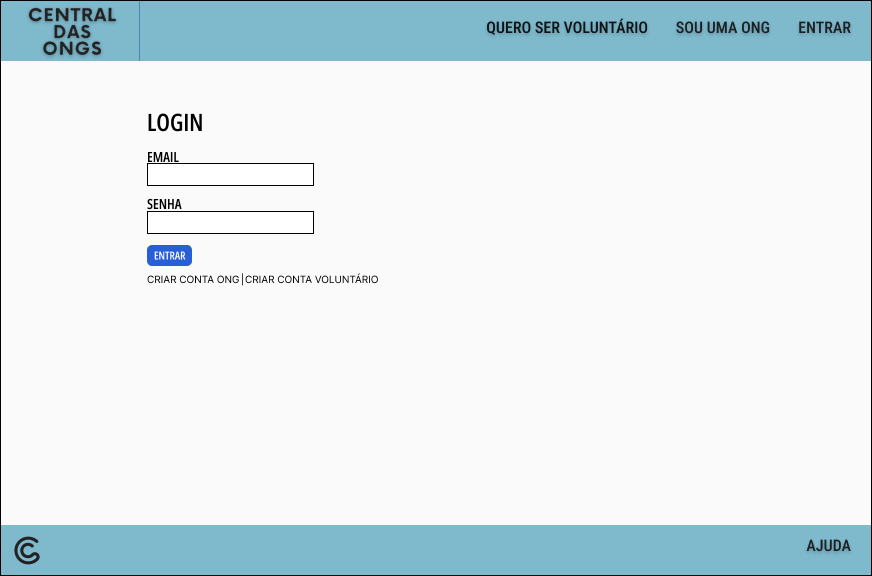
Ao clicar no botão 'Entrar', é possível ver as entradas de login (e-mail e senha) e ainda a opção 'Não possuo cadastro'.

**Tela 3**

Se a opção 'Não possuo cadastro' for escolhida, o usuário verá as opções 'Quero ser voluntário' e 'Sou uma ONG'.

**Tela 4**
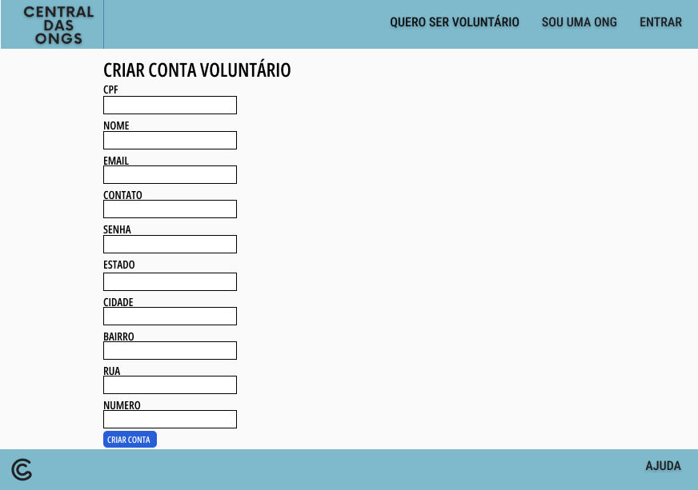
A tela de cadastro do voluntário exige que o usuário preencha os campos com nome, data de nascimento, CPF, causas que deseja apoiar, suas habilidades, cidade de residência e telefone, bem como as informações de login como E-mail e senha.

** Tela 5 **
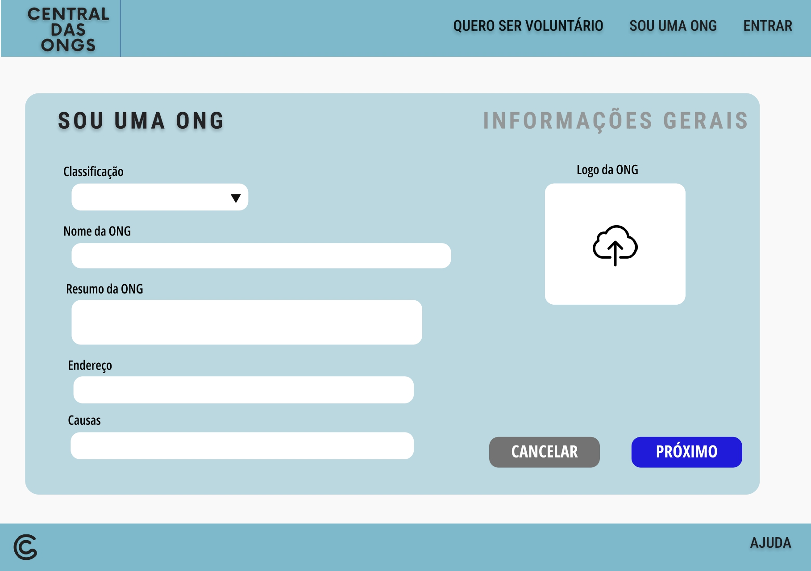
O cadastro da ONG é dividido em duas partes, sendo a primeira com informações gerais sobre a organização, como nome, endereço, logo e causas.

**Tela 6**
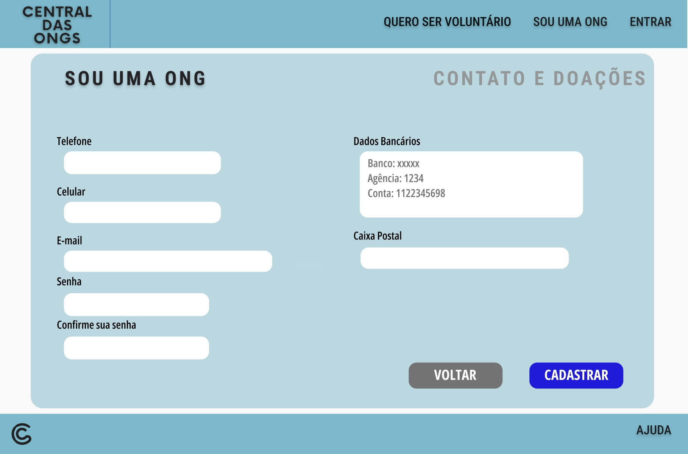
Na segunda parte do cadastro, são necessárias as informações de contato e login, assim como os dados bancários da organização para a realização de doações.

**Tela 7**
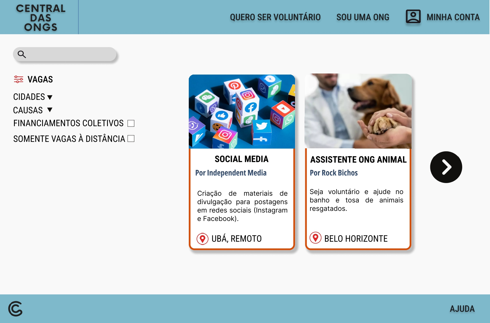
Após realizar o login, tanto o usuário Voluntário, como o usuário ONG verão a mesma tela.

**Tela 8**
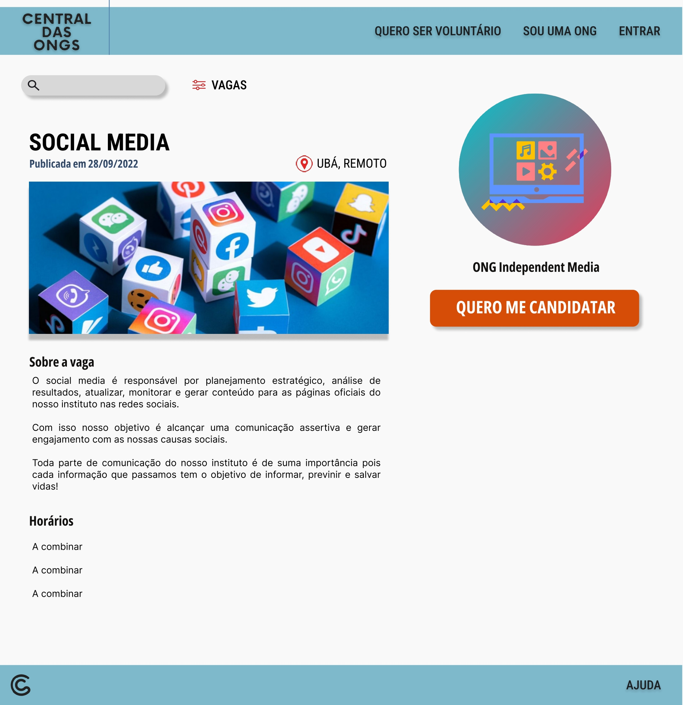
Quando selecionar uma vaga, o Voluntário poderá ver a descrição, localização e os horários da vaga. Caso queira se candidatar, o usuário deverá clicar no botão ao lado direito escrito 'Quero me candidatar'.

**Tela 9**
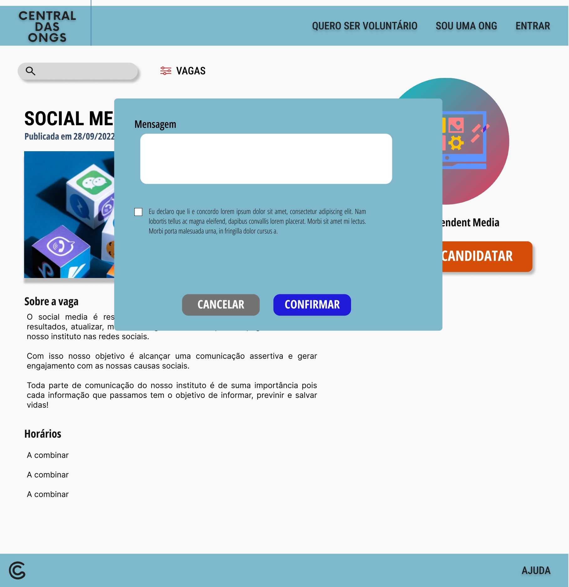
Ao clicar no botão, o Voluntário poderá deixar uma mensagem para a organização especificando a motivação para a inscrição na vaga. Além disso, ele deverá concordar com os termos apresentados.

**Tela 8**

Ao clicar no botão 'Minha conta', o usuário Voluntário verá as opções 'Editar perfil', 'Minhas candidaturas' e 'Sair'.

**Tela 9**

A opção de 'Editar Perfil' apresenta os mesmos dados utilizados no cadastro que podem ser editados. Além disso, é possível escolher uma foto para o perfil e o usuário também poderá excluir sua conta nessa opção.

**Tela 10**

Quando o usuário clicar em 'Minhas candidaturas' a tela apresetará as vagas ativas em que o usuário se candidatou, e também a opção de visualizar vagas encerradas.

**Tela 11**
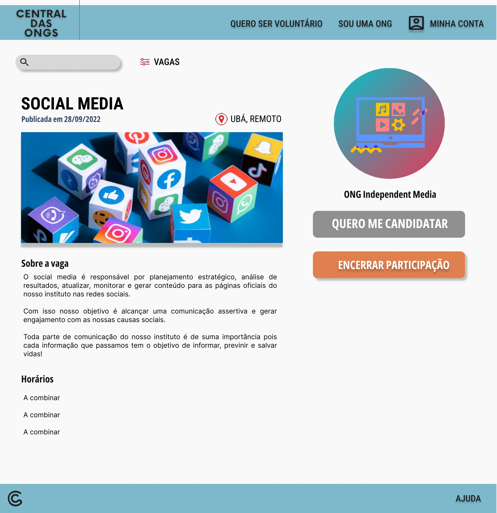
Ao escolher uma das vagas que se candidatou, o usuário Voluntário poderá encerrar sua participação na vaga.

**Tela 12**
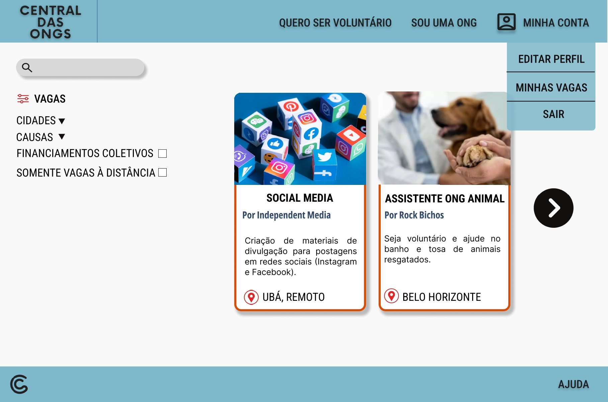
Já nas opções do perfil do usuário ONG, é possível ver 'Editar perfil', 'Minhas vagas' e 'Sair'.

**Tela 13**
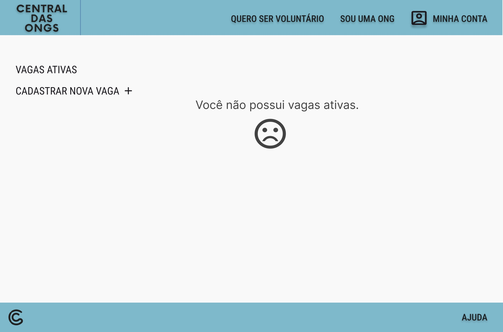
Caso o usuário não tenha cadastrado nenhuma vaga, ele verá uma tela com a mensagem 'Você não possui vagas ativas.'

**Tela 14**
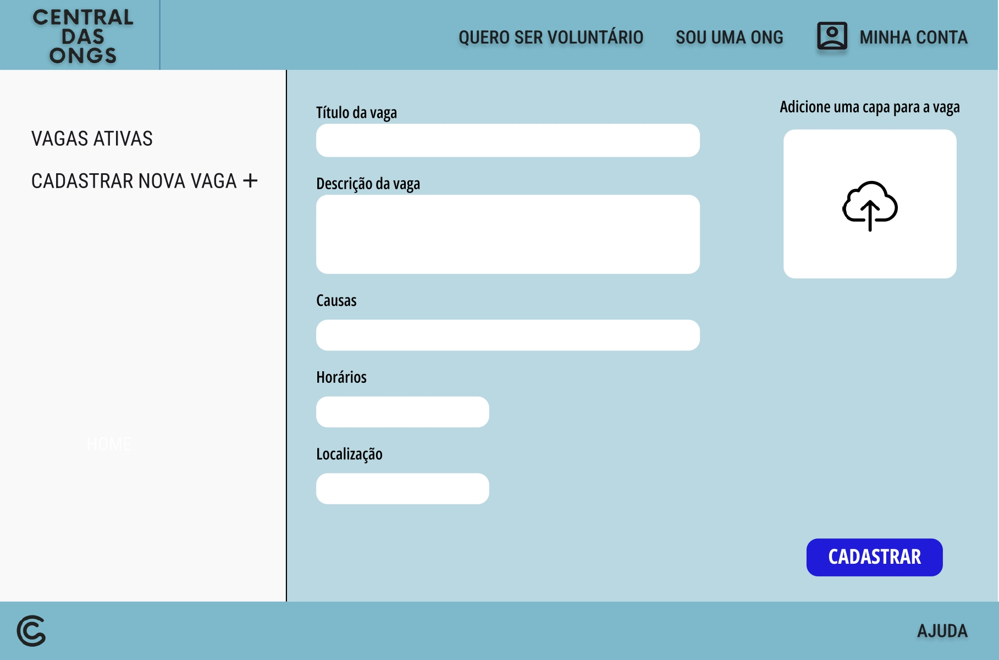
Através do botão do lado esquerdo, é possível cadastrar uma nova vaga, incluindo os campos de 'Título', 'Descrição', 'Causas', 'Horários' e 'Localização'. Também é possível adicionar uma imagem de capa para a vaga.

**Tela 15**
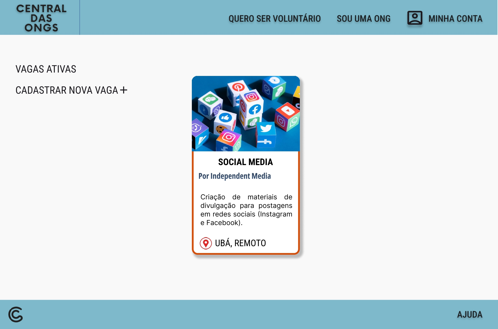
Quando possuir vagas ativas é possível vê-las dispostas no centro da tela.

**Tela 16**
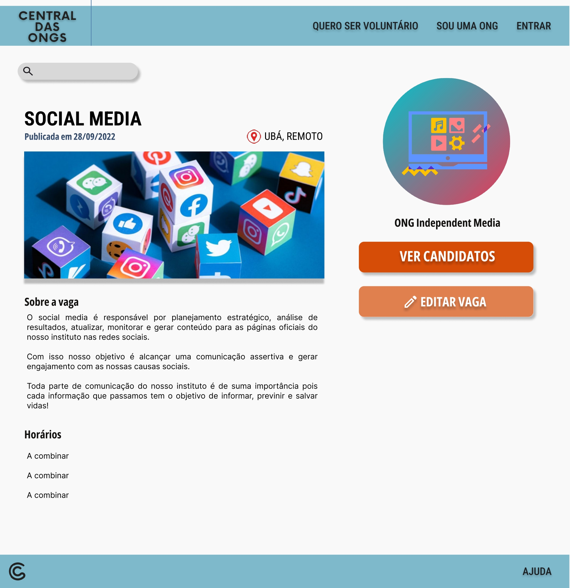
Ao selecionar uma das vagas ativas, o usuário pode selecionar a opção 'Editar vaga' ou 'Ver candidatos'.

**Tela 17**
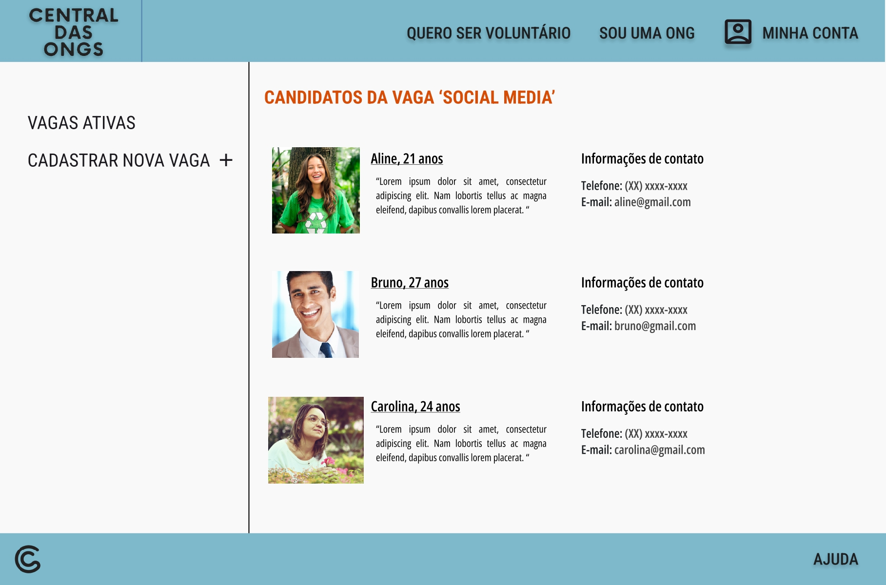
Ao selecionar essa opção, o usuário verá os candidatos inscritos para a vaga com as informações de contato e a mensagem deixada por eles na candidatura. Além disso, ao lado de cada candidato, existe a opção de aprovar ou recusar a candidatura.
