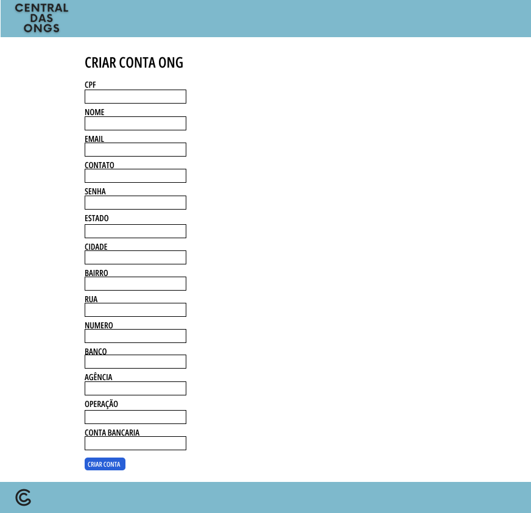

# Projeto de Interface
As telas foram projetadas de modo intuitivo pensando na facilidade do usuário de encontrar as funcionalidades desejadas. Todos os wireframes foram feitos na plataforma Figma, utilizando o método de protótipo para testar cada uma das funcionalidades apresentadas nos requisitos e histórias de usuário.

## Diagrama de Fluxo

## Wireframes

### Tela inicial - Homepage
A tela inicial apresenta as vagas disponíveis no momento, bem como as opções de filtro no campo esquerdo. No canto superior direito, podemos ver os botões 'Entrar', 'Quero ser voluntário' e 'Sou uma ONG'.

### Tela 2
Ao clicar no botão 'Entrar', é possível ver as entradas de login (e-mail e senha) e ainda as opções para criar conta como ONG ou Usuário.

### Tela 3
A tela de cadastro do voluntário exige que o usuário preencha os campos com nome, data de nascimento, CPF, endereço e telefone, bem como as informações de login como e-mail e senha.

### Tela 4
A tela de cadastro da ONG exige que o usuário preencha os campos com nome, CNPJ, endereço, telefone e dados bancarios bem como as informações de login como E-mail e senha.

### Tela 5
Após realizar o login, tanto o usuário Voluntário, como o usuário ONG verão a mesma tela.

### Tela 6
Quando selecionar uma vaga, o voluntário poderá ver a descrição da mesma. Caso queira se candidatar, o usuário deverá clicar no botão ao lado direito escrito 'Quero me candidatar'.

### Tela 7
O voluntário poderá deixar uma mensagem para a organização especificando a motivação para a inscrição na vaga.

### Tela 8
Ao clicar no botão 'Minha conta', o usuário Voluntário verá as opções 'Editar perfil' e 'Minhas candidaturas'.

### Tela 9
A opção de 'Editar Perfil' apresenta os mesmos dados utilizados no cadastro que podem ser editados.

### Tela 10
Quando o usuário clicar em 'Minhas candidaturas' a tela apresetará as vagas em que o usuário se candidatou.

### Tela 11
Ao escolher uma das vagas que se candidatou, o usuário voluntário poderá encerrar sua participação na vaga.

#### Tela 12
Já nas opções do perfil do usuário ONG, é possível ver 'Editar perfil' e 'Minhas vagas'.

### Tela 13
A ONG poderá cadastrar novas vagas por meio do preenchimento do formulário.

### Tela 14
Quando a ONG possuir vagas cadastradas é possível vê-las dispostas na tela.

### Tela 15
Ao selecionar uma das vagas ativas, a ONG pode selecionar a opção 'Editar vaga' ou 'Ver candidatos'.

### Tela 16
Ao selecionar essa opção, o usuário verá os candidatos inscritos para a vaga com as informações de contato e a mensagem deixada por eles na candidatura.

